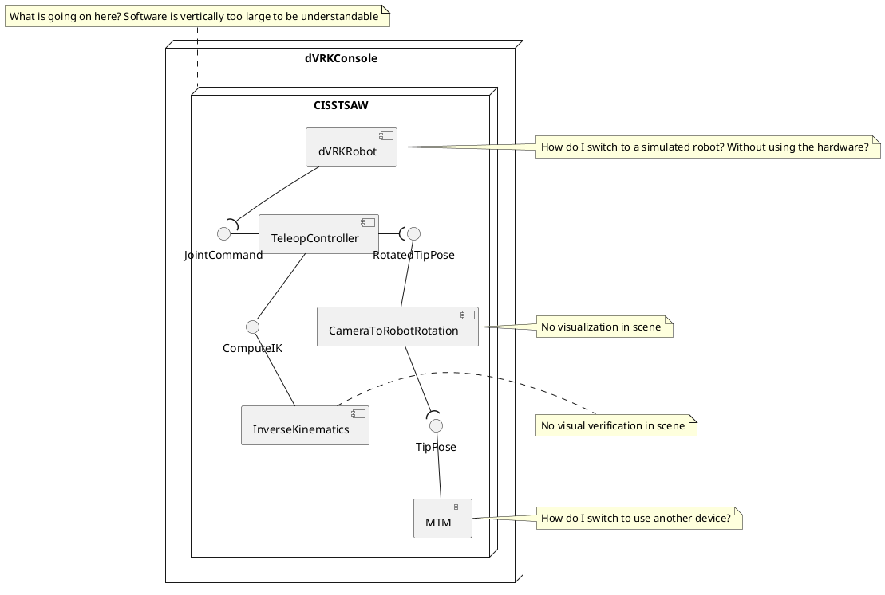
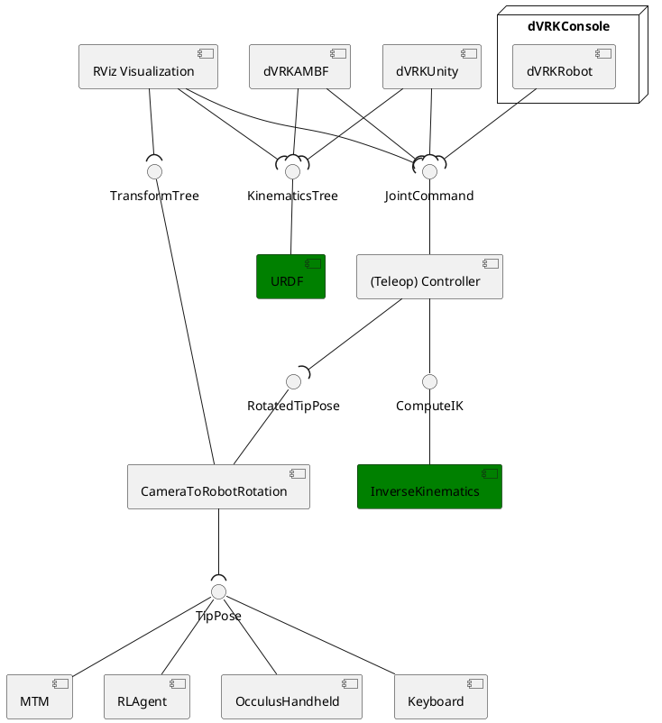

Old framework

```plantuml
@startuml

node dVRKConsole{
    node CISSTSAW{
        component TeleopController

        interface RotatedTipPose
        TeleopController -right-( RotatedTipPose

        component  CameraToRobotRotation
        RotatedTipPose -- CameraToRobotRotation

        component MTM
        interface TipPose
        TipPose -- MTM
        CameraToRobotRotation --( TipPose

        component dVRKRobot
        interface JointCommand
        dVRKRobot --( JointCommand
        JointCommand -right- TeleopController

        interface ComputeIK
        component InverseKinematics

        ComputeIK -- InverseKinematics
        TeleopController -- ComputeIK

    }
}

note right of CameraToRobotRotation : No visualization in scene
note right of InverseKinematics : No visual verification in scene

note right of dVRKRobot : How do I switch to a simulated robot? Without using the hardware?
note right of MTM : How do I switch to use another device?

note top of CISSTSAW : What is going on here? Software is vertically too large to be understandable

@enduml
```

New Framework

```plantuml
@startuml

component TeleopController as "(Teleop) Controller"

interface RotatedTipPose
TeleopController --( RotatedTipPose

interface TipPose
component  CameraToRobotRotation
RotatedTipPose -- CameraToRobotRotation
CameraToRobotRotation --( TipPose

component MTM
TipPose -- MTM
component RLAgent
TipPose -- RLAgent
component OcculusHandheld
TipPose -- OcculusHandheld
component Keyboard
TipPose -- Keyboard

node dVRKConsole {
    component dVRKRobot
}
component dVRKUnity
component dVRKAMBF

interface JointCommand
dVRKRobot --( JointCommand
dVRKUnity --( JointCommand
dVRKAMBF --( JointCommand

JointCommand -- TeleopController

interface ComputeIK
component InverseKinematics #Green

ComputeIK -- InverseKinematics
TeleopController -- ComputeIK

component RViz as "RViz Visualization"
interface TransformTree
RViz --( TransformTree
RViz --( JointCommand

TransformTree -- CameraToRobotRotation

component URDF #Green
interface KinematicsTree
KinematicsTree -- URDF

dVRKUnity --( KinematicsTree
dVRKAMBF --( KinematicsTree
RViz --( KinematicsTree

@enduml
```
